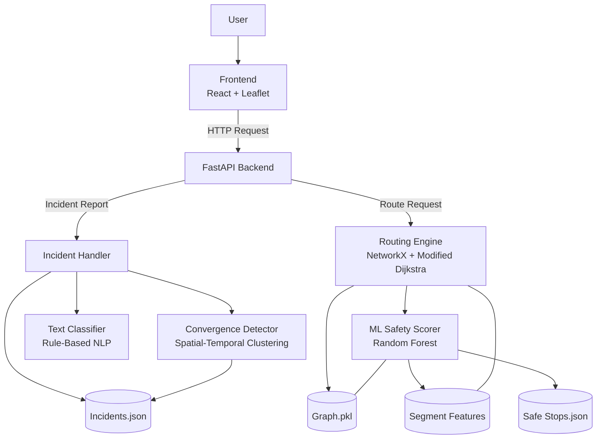

# SafeCompanion

AI-Powered Safety-Optimized Routing for Vulnerable Campus Populations

SafeCompanion is a full-stack AI web application that recommends the safest walking route — not the fastest — for campus users including women, freshers, elderly individuals, night-shift workers, and differently-abled students.

Unlike traditional navigation systems that optimize for speed and distance, SafeCompanion maximizes cumulative safety probability across road segments using a trained machine learning model and a modified graph routing algorithm.

Pilot deployment: IIT Bombay campus (OpenStreetMap via OSMnx).  
Architecture designed to scale to any city.


# Problem Statement

On campuses, route decisions are influenced by perceived safety rather than distance.

Pilot survey (10 college students across Indian campuses):

| Question | Result |
|----------|--------|
| Avoid routes at night | 90% |
| Call someone while walking alone | 70% |
| Would use safety-prioritized routing | 100% |
| Would submit quick anonymous reports | 60% |

No mainstream navigation system integrates safety directly into the routing objective function.


# Core Differentiation

## Routing Objective Function

Traditional routing:

```text
minimize  Σ distance(edge)
```

SafeCompanion routing:

```text
minimize  Σ -log(safety_probability(edge))
≡ maximize Π safety_probability(edge)
```

Safety is mathematically embedded in the routing cost function.  
It is not a visual overlay or post-filter.


# System Overview

## Safety Probability Per Road Segment

Each road segment receives a safety probability (0–1) using a Random Forest classifier.

Features:

- lighting_score (OSM road type + calibration)
- incident_density (community reports)
- safe_stop_proximity (Haversine normalized distance)
- time_sin / time_cos (cyclic hour encoding)
- day_sin / day_cos (cyclic weekday encoding)


## Modified Dijkstra Routing

```text
cost(edge) = -log(safety_probability)
```

Two routes are computed:

- Fastest (distance optimized)
- Safest (probability optimized)


## Confidence Index

```text
confidence =
[log(1 + total_reports) / log(1 + MAX_REPORTS)]
× exp(-hours_since_last_report / 48)
```

Prevents sparse-data regions from appearing falsely safe.


# Features

## AI Safety Routing
- Fastest vs safest comparison
- Real-time rerouting after incidents
- Per-segment ML safety scoring

## Community Incident Reporting
- Pin exact location
- Rule-based text categorization
- Only affected edge recalculated

## Convergence Alert Detection
- Spatial-temporal clustering (Haversine radius + time window)
- Automatic alert generation
- Persistent flagged zones across reroutes


# AI Components

| Component | Technology | Purpose |
|------------|------------|----------|
| Safety Scorer | Random Forest (scikit-learn) | Per-segment safety probability |
| Routing Engine | NetworkX + Dijkstra | Modified safety pathfinding |
| Graph Extraction | OSMnx | Campus road network |
| Confidence Model | Statistical formula | Data reliability scoring |
| Text Classifier | Rule-based NLP | Fast incident categorization |
| Convergence Detector | Haversine clustering | Alert generation |


# Why Random Forest

- Interpretable (feature importance available)
- Fast batch inference
- Small model size (~3–5MB)
- CPU and edge deployable

Cross-validated accuracy: ~78–83%.


# System Architecture

## High-Level Flow




# Tech Stack

## Frontend
- React 18
- Leaflet
- React-Leaflet
- Tailwind CSS
- Axios
- Vite

## Backend
- Python 3.10+
- FastAPI
- Uvicorn
- Pydantic

## Machine Learning
- scikit-learn
- OSMnx
- NetworkX
- NumPy
- Pandas
- Matplotlib


# Model Training

## Dataset
- 5,000-row synthetic dataset
- Calibrated using NCRB statistics
- Gaussian noise added
- 8% label flip to prevent formula memorization

## Configuration

```python
RandomForestClassifier(
    n_estimators=100,
    max_depth=8,
    n_jobs=-1,
    random_state=42
)
```

Cross-validated accuracy: ~78–83%.

---

# Inference Pipeline

1. Encode cyclic time/day features  
2. Build DataFrame of all road edges  
3. Single batch predict_proba() call  
4. Clamp probabilities (min 0.01)  
5. Apply -log(prob) transformation  
6. Run modified Dijkstra  

Average inference time: ~15ms on Ryzen 5.

---

# Project Structure

```text
safecompanion/
│
├── frontend/
├── backend/
├── ml/
├── scripts/
├── screenshots/
└── README.md
```


# Demo Flow

1. Select origin  
2. Select destination  
3. View fastest vs safest route  
4. Submit incident reports  
5. Observe automatic rerouting  
6. Alert zones persist across new requests  


# Deployment Model

| Scale | Estimated Monthly Cost |
|--------|------------------------|
| Campus pilot | ₹0 |
| Single campus | ₹1,500–3,000 |
| Multi-campus | ₹8,000–15,000 |
| Municipal | ₹20,000–40,000 |

Infrastructure cost only. No licensing dependency.


# Future Roadmap

- City-scale expansion  
- Predictive risk forecasting  
- Public transit integration  
- ONNX edge deployment  
- Multilingual NLP  
- Human-in-loop moderation  


# License

MIT License
